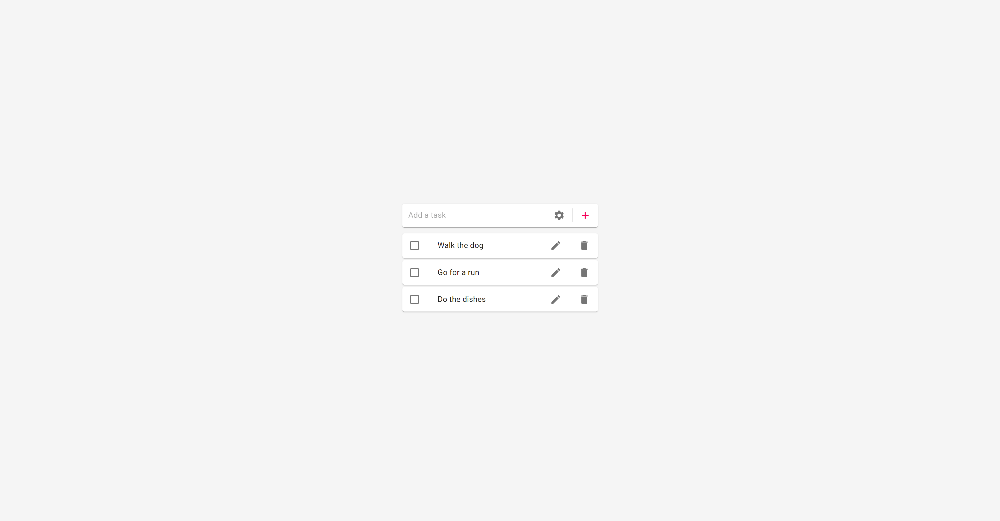

# Modern Hangman

This Todo app allows users on desktop or mobile to add items to their list and keep track of what needs to be done.

## Table of contents

- [Overview](#overview)
  - [Description](#description)
  - [Screenshot](#screenshot)
  - [Links](#links)
- [My process](#my-process)
  - [Built with](#built-with)
  - [What I learned](#what-i-learned)
  - [Useful resources](#useful-resources)
- [Author](#author)

## Overview

### Description

This Todo App is mobile friendly. Users can add tasks to their list, once items are in the list they can be edited again, checked off, or deleted from the list. [WIP] settings to allow a user to change color themes and fonts

### Screenshot

### Links

- Live Site URL: [https://aaron-soto.github.io/to-do-app/](https://aaron-soto.github.io/to-do-app/)

## My process

### Built with

- [React](https://reactjs.org/) - JS library
- SCSS with custom mixins and variables
- useState, useEffect hooks
- Material UI

### What I learned

I learned to use Material UI to allow for a more friendly user experience. Also managing an array to allow for better displaying of items for the user.

### Useful resources

- [React Js Docs](https://reactjs.org/docs/hooks-reference.html) - I went straight to the source for this one and went through the react docs.

## Author

- Website - [Aaron Soto](https://aaronsoto.io)
- Github - [@aaron-soto](https://github.com/aaron-soto)
- Linkedin - [@aaron-soto1](https://www.linkedin.com/in/aaron-soto1/)
